

 

# AASIF // DEVELOPER SYSTEM

### `CSE` • `UI/UX` • `WEB` • `AI` • `GAME DEV`

**Turning Ideas Into Reality. 🚀**

  
  

---

## 👨‍💻 ABOUT // AASIF

> **A Computer Science student who likes turning ideas into interfaces, prototypes, systems, and experiences.**

I enjoy working across the full journey of a project — from **idea → UI/UX → development → backend → database → AI → deployment**.

| 🌐 WEB | 🎨 UI/UX | 🤖 AI | 🎮 GAME DEV |
|:---:|:---:|:---:|:---:|
| Digital experiences | Visual systems | Intelligent experiments | Interactive worlds |

### 🧠 CURRENT STACK

`HTML` `CSS` `JavaScript` `Python` `C++` `Figma` `Git` `GitHub` `Firebase` `Vercel` `Blender` `Unity`

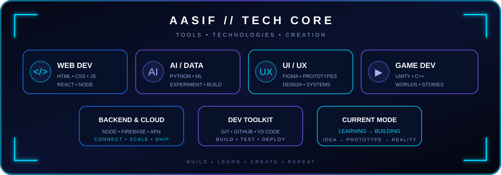

---

## 🖥️ SYSTEM // TERMINAL

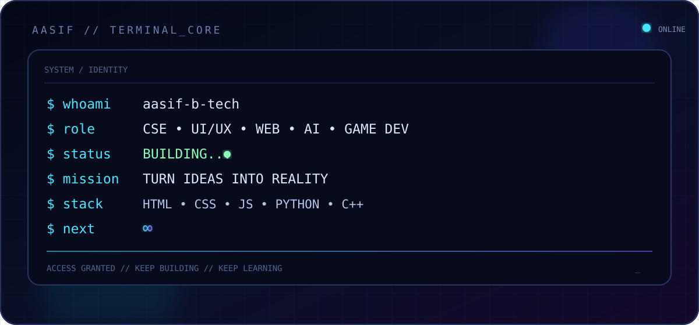

---

## ⚡ BUILD PROTOCOL

**💡 IDEA**  
↓  
**🎨 UI/UX**  
↓  
**💻 DEVELOPMENT**  
↓  
**⚙️ BACKEND**  
↓  
**🗄️ DATABASE**  
↓  
**🤖 AI / AUTOMATION**  
↓  
**🚀 PRODUCT**

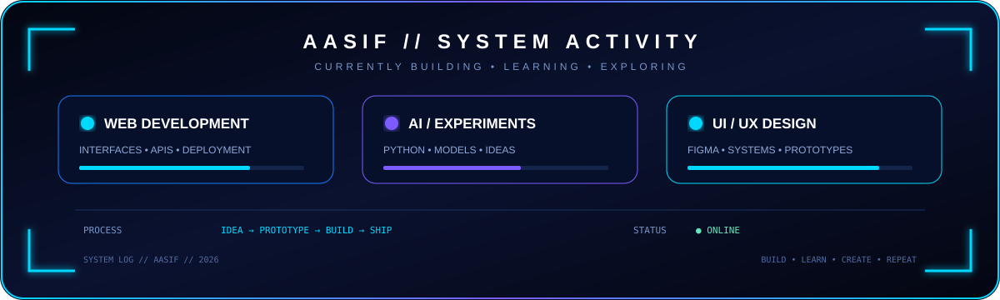

---

## 🚀 PROJECT UNIVERSE

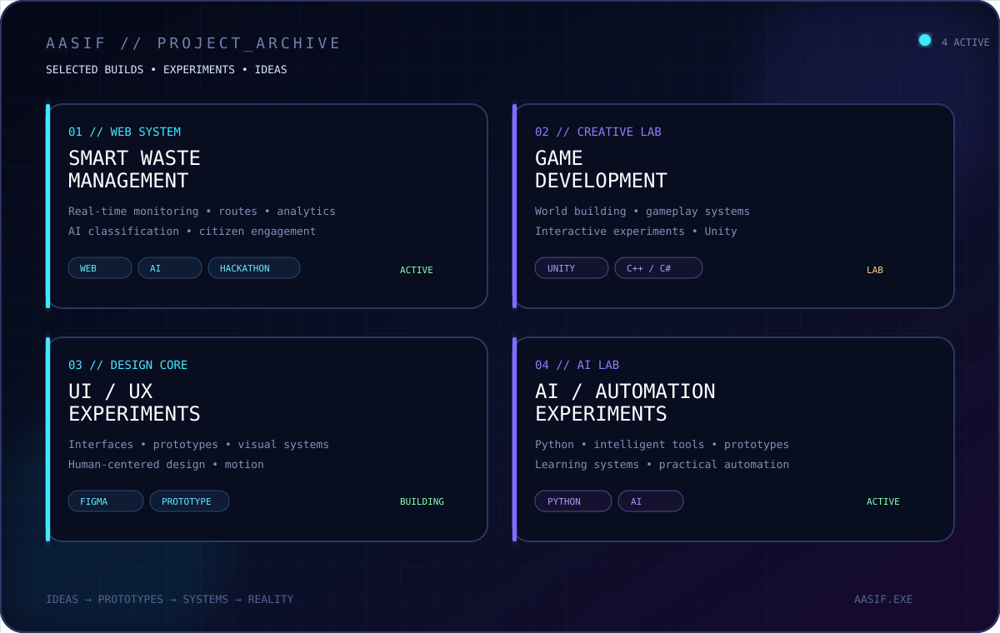

### 🌌 HyperNova

Hackathon-focused engineering for solving real-world problems through technology.

### 🌐 Web Experiences

Responsive websites, interactive interfaces, animations, dashboards, and digital experiences.

### 🤖 AI Experiments

Exploring practical AI, automation, intelligent systems, and creative applications.

### 🎮 Game Development

Experimenting with Unity, game mechanics, interactive worlds, visual storytelling, and gameplay concepts.

---

## 🎌 CREATIVE UNIVERSE

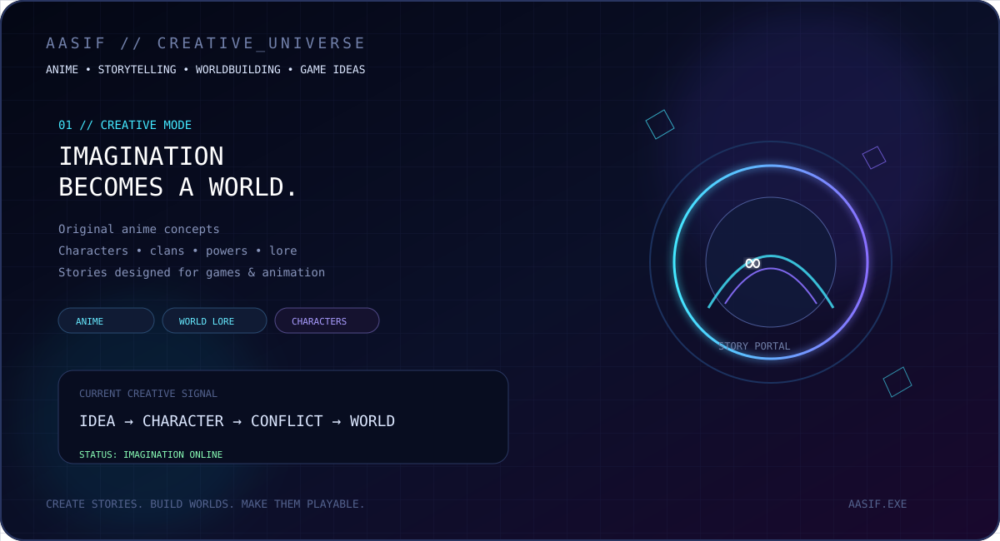

Anime, storytelling, characters, clans, powers, lore, game worlds, and original ideas are part of the creative side of the system.

**IDEA → CHARACTER → CONFLICT → WORLD**

---

## 📊 GITHUB // COMMAND CENTER

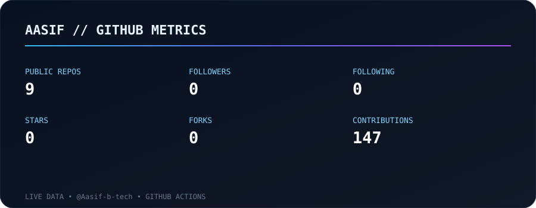

  

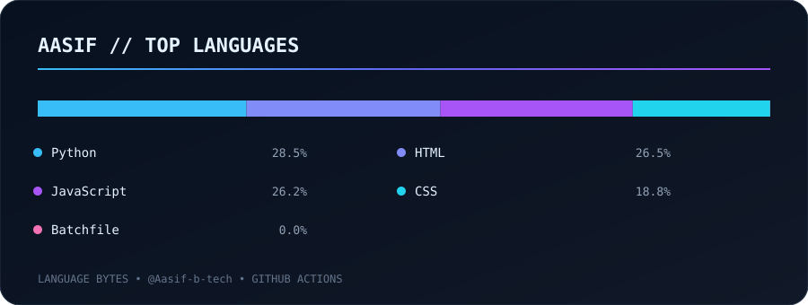

  

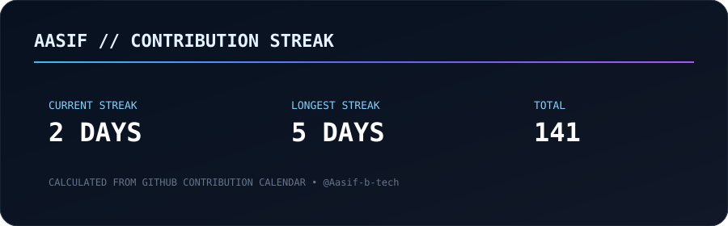

---

## 📈 CONTRIBUTION // ACTIVITY

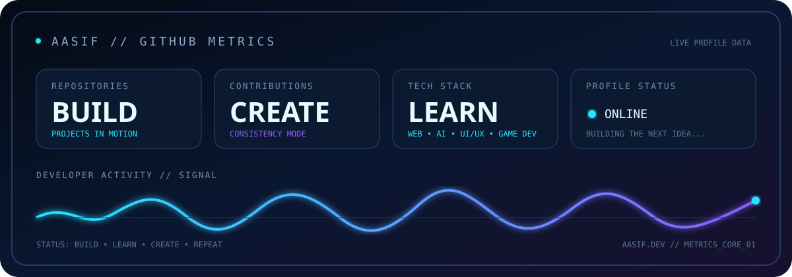

---

## 🐍 CONTRIBUTION // JOURNEY

---

## 🗺️ TIMELINE // BUILD EVOLUTION

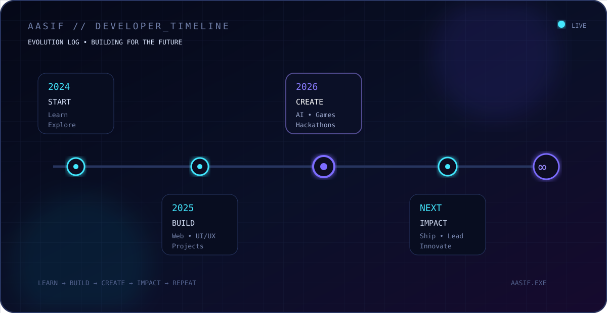

---

## 🎯 2026 // FUTURE ROADMAP

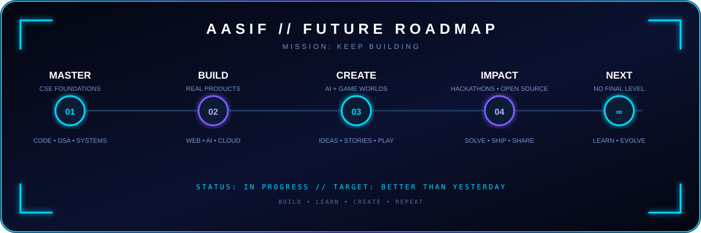

- 🚀 Grow stronger as a full-stack developer
- 🤖 Build practical AI applications
- 🎨 Improve modern UI/UX and visual design
- 🧩 Strengthen DSA and problem solving
- 🎮 Build and publish a game
- 🏆 Compete in more hackathons
- 🌐 Build projects people can actually use

---

## 🛠️ SKILLS // CORE MODULES

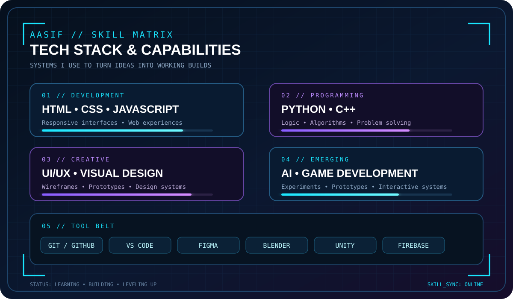

---

## 💼 EXPERIENCE // BUILD HISTORY

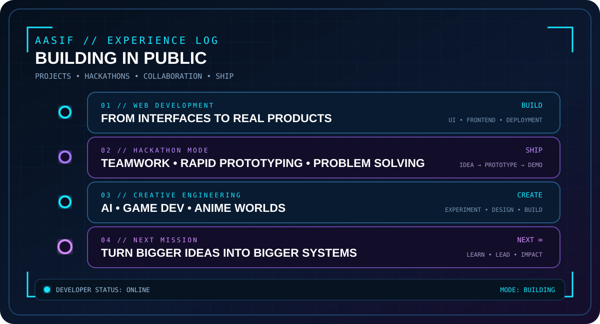

---

## 🎓 EDUCATION // KNOWLEDGE CORE

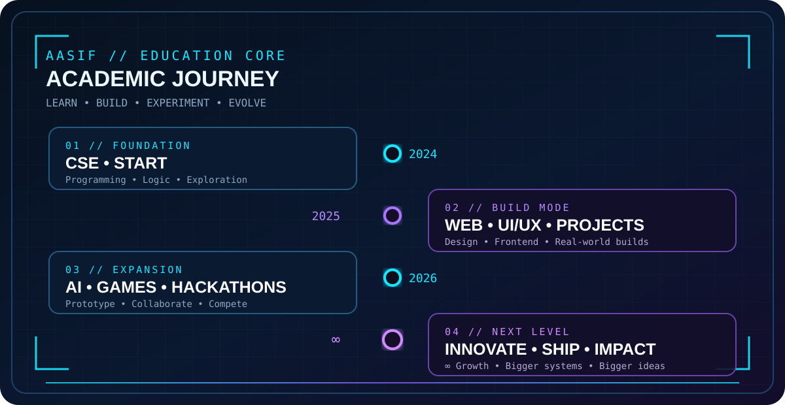

---

## 🏆 CERTIFICATIONS // ACHIEVEMENT VAULT

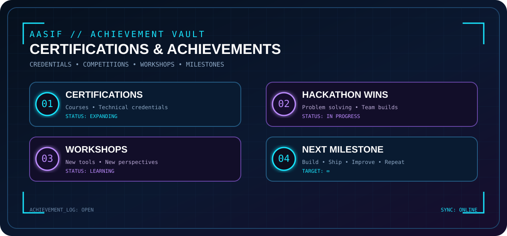

---

## ❤️ INTERESTS // BEYOND CODE

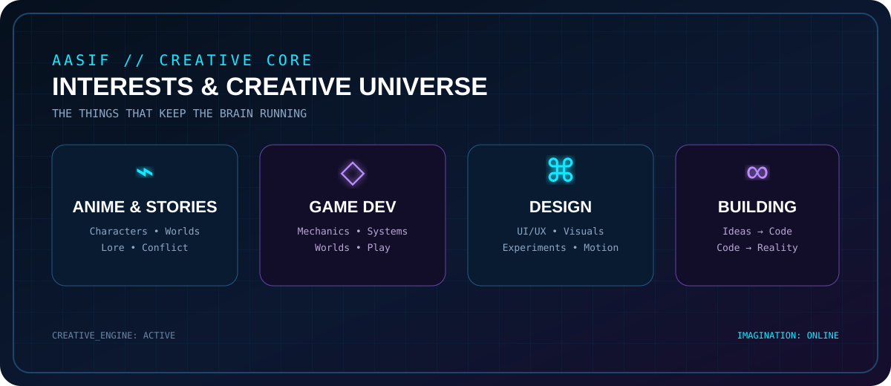

**Anime • Game Development • Storytelling • Design • Music & AI • Creative Ideas**

---

## 🎧 NOW PLAYING // BUILD MODE

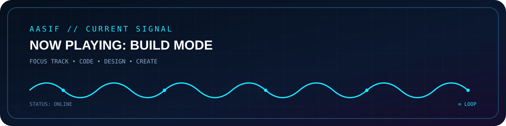

**THINK → BUILD → IMPROVE**

---

## 💬 TRANSMISSION // QUOTE

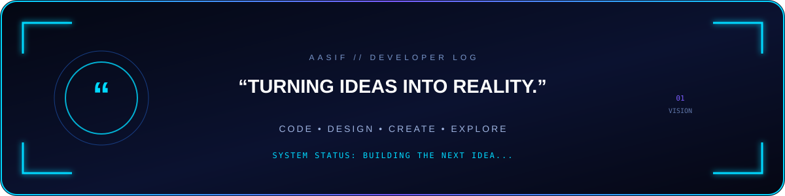

---

## 📡 CONNECT // OPEN CHANNEL

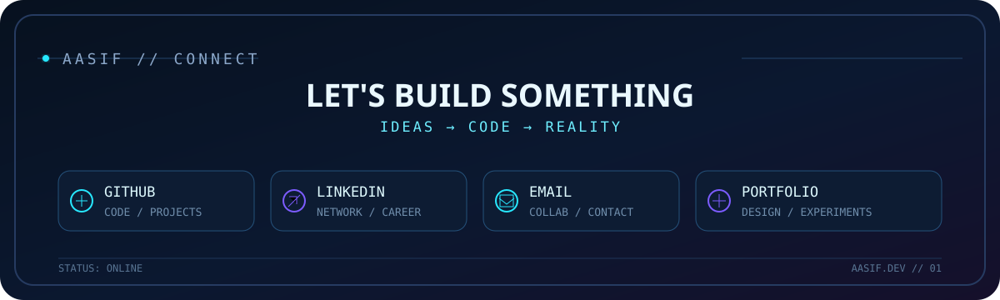

---

### 🔥 BUILD • BREAK • LEARN • REBUILD 🔥

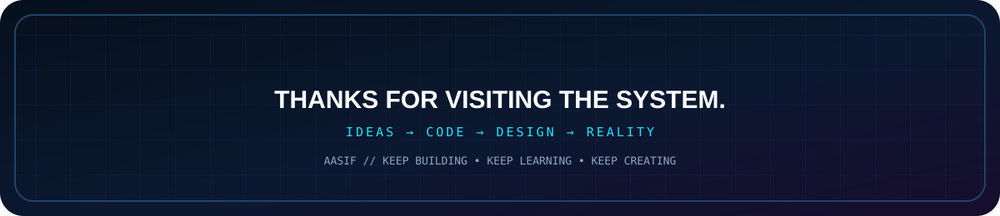

 

**Thanks for visiting my developer system. ⚡**

